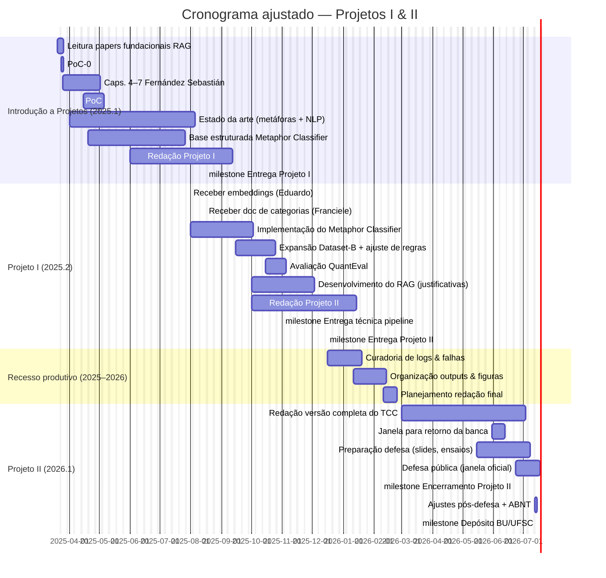

## **Introdução**

A classificação automática de metáforas constitui um desafio clássico no campo do processamento de linguagem natural (PLN), devido à natureza abstrata e dependente de contexto das expressões metafóricas. Diferentemente das abordagens tradicionais que buscam identificar a presença ou ausência de metáforas, este trabalho recebe metáforas já detectadas em um pipeline prévio e propõe classificá-las em categorias específicas baseadas no referencial histórico proposto por Fernández Sebastián (2024). Esta classificação, sustentada teoricamente pelo estudo qualitativo e erudito das fontes históricas, visa compreender mais profundamente os padrões e o desenvolvimento das metáforas ao longo do tempo. Essa tarefa ocorre no contexto da construção de um dataset diacrônico — um recurso ainda relativamente raro em PLN — cuja curadoria está sendo conduzida por outros membros da equipe. O presente trabalho contribui com sua expansão e validação por meio da classificação automatizada das metáforas e da recuperação de evidências históricas.

Além disso, o projeto contempla dois módulos complementares: o *Metaphor Classifier*, que classifica e expande o conjunto de metáforas por meio da recuperação de trechos semanticamente semelhantes nas fontes históricas; e o *RAG* (Retrieval-Augmented Generation), responsável por gerar justificativas textuais embasadas, citando passagens das obras consultadas. Este segundo módulo combina capacidades avançadas dos modelos grandes de linguagem (LLMs) com mecanismos de recuperação automatizada de contextos históricos e literários relevantes. Espera-se, assim, contribuir para uma compreensão mais fundamentada e transparente de metáforas em corpora históricos, oferecendo suporte empírico para hipóteses historiográficas.

---

## **Objetivos**

### **Objetivo Geral**
Desenvolver e integrar dois módulos: o *Metaphor Classifier*, responsável por atribuir categorias históricas a metáforas previamente detectadas e expandir o conjunto de exemplos por meio de recuperação semântica de ocorrências análogas; e o *RAG*, voltado à geração de justificativas textuais embasadas, citando evidências históricas relevantes para cada classificação.

### **Objetivos Específicos**

1. **Construção de regras de categorização**  
   Desenvolver regras interpretáveis com base em um documento de categorias e exemplos elaborado por historiadores, de modo a possibilitar a atribuição automática ou semi-automática de categorias históricas a metáforas detectadas.

2. **Metaphor Classifier — Recuperação de evidências históricas**  
   Dado um conjunto de metáforas detectadas, atribua categorias históricas e recupere metáforas similares em contextos históricos, compondo pares metáfora ↔ evidência textual.

3. **RAG — Geração de justificativas explicativas**  
   Desenvolver um segundo módulo capaz de gerar respostas textuais explicativas para cada metáfora classificada, citando a evidência textual recuperada e a justificando com base na categoria histórica atribuída.

4. **Avaliação funcional do pipeline**  
    Avaliando-os com métricas formais (como F1-score ou precisão, se aplicável) ou, se simbólicos, com checklist qualitativo.

5. **Documentação e replicabilidade prática**  
   Manter documentação clara e progressiva no repositório do projeto, incluindo instruções de uso, descrição das etapas e exemplos de entrada e saída para cada módulo.

6. **Flexibilidade de escopo e adaptação contínua**  
   Conduzir o desenvolvimento sob abordagem iterativa e adaptativa, permitindo ajustes de rota conforme os dados e insumos forem disponibilizados por terceiros, respeitando os marcos definidos no cronograma.

### Escopo do Trabalho

#### 1 · Entradas externas (pré-requisitos)

| Origem     | Entregável                                                           | Data prevista    | Formato                      | Observação                                                   |
|------------|----------------------------------------------------------------------|------------------|------------------------------|--------------------------------------------------------------|
| Eduardo    | Embeddings vetoriais das obras históricas                            | 31 jul 2025      | Parquet / FAISS / Chroma     | Exclusivo para recuperação semântica do Metaphor Classifier  |
| Franciele  | Documento com categorias de Fernández Sebastián + 3 exemplos de cada | 15 ago 2025      | Doc / Markdown               | Base para regras de categorização                            |

#### 2 · Contribuições diretas do autor

| **Módulo**              | **Descrição resumida**                                                                                                                                                      | **Critério de aceite**                                                                             |
|-------------------------|-----------------------------------------------------------------------------------------------------------------------------------------------------------------------------|----------------------------------------------------------------------------------------------------|
| **Metaphor Classifier** | Script que classifica metáforas previamente detectadas e recupera expressões análogas em obras históricas, ampliando o dataset por proximidade semântica.                   | Gera ≥ 100 pares (*metáfora, evidência, categoria*); execução end-to-end comprovada                |
| **QuantEval**           | Avaliação da qualidade e coerência dos pares gerados, via checklist, verificação manual ou análise de cobertura.                                                            | Relatório técnico em Markdown com amostra comentada ou validação formal                            |
| **RAG**                 | Gera justificativas textuais com base na evidência recuperada, justificando a classificação atribuída.                                                                      | Executável sobre ≥ 10 metáforas distintas, com justificativas coerentes e citação da fonte textual |
| **Docs**                | Documentação viva no repositório (README, exemplos de uso, instruções e observações de implementação) atualizada a cada etapa funcional.                                    | Toda etapa entregue deve conter documentação correspondente no repositório                         |

#### 3 · Fora do escopo

- Detecção inicial de metáforas (Classificação Binária) 
- Dataset-A (pré-existente)  
- OCR, interface web  
- LLM fine-tuned usada no RAG (fornecida por terceiros)

#### 4 · Premissas & restrições

- VLab-UFSC disponível com GPU/CPU até **dez 2025**; 2026 não requer execução de código.  
- Textos históricos em domínio público; nenhuma licença adicional é necessária.  
- Volume de dados modesto (< 10 GB); notebook pessoal e Google Drive são suficientes como redundância.  
- Se embeddings ou categorias atrasarem, o escopo será reduzido ou o autor assumirá tarefas extras.

#### 5 · Cronograma técnico resumido

- **mar–abr 2025**
  - Leitura de fundamentos sobre RAG
  - PoC inicial com prompt fixo
  - Leitura dos capítulos 4–7 de Fernández Sebastián
  - Estudo do estado da arte sobre PLN e metáforas
  - Base estruturada inicial do *Metaphor Classifier*

- **jul–ago 2025**
  - Recebimento dos embeddings (Eduardo)
  - Recebimento do documento de categorias (Franciele)
  - Implementação do *Metaphor Classifier*

- **set–out 2025**
  - Expansão do Dataset-B com recuperação de metáforas similares
  - Ajuste das regras de categorização com base nas novas evidências
  - Avaliação funcional do *Metaphor Classifier* (QuantEval)
  - Desenvolvimento do módulo *RAG* (geração de justificativas textuais)
  - Redação do Projeto II

- **dez 2025 – fev 2026**
  - Curadoria de logs e análise de falhas
  - Organização de outputs e documentação técnica
  - Planejamento da redação final do TCC

- **mar–mai 2026**
  - Redação da versão completa do TCC final

- **jun 2026**
  - Margem para retorno da banca antes da defesa
  - Preparação da defesa pública (slides, ensaios)

- **jul 2026**
  - Ajustes finais e formatação ABNT
  - Depósito do TCC na BU/UFSC

---

## **Método de Pesquisa**

Adotar-se-á uma abordagem mista, combinando métodos quantitativos e qualitativos. A dimensão **quantitativa** será utilizada sempre que o processo de classificação empregar modelos supervisionados, com aplicação de métricas como *F1-score*, *precision* e cobertura. Caso o classificador opere de forma simbólica, a avaliação seguirá uma abordagem qualitativa baseada em checklist, com inspeção manual da correspondência entre metáfora, categoria atribuída e evidência textual recuperada.

A dimensão **qualitativa** estará presente tanto na definição das categorias quanto na validação da coerência histórico-conceitual dos pares gerados (*metáfora ↔ evidência*). Nessa etapa, as classificações e justificativas produzidas pelos módulos serão analisadas à luz do referencial de Fernández Sebastián, com apoio da equipe de historiadores do projeto.

Trata-se de um estudo descritivo-exploratório, cujo objetivo principal é mapear e caracterizar padrões metafóricos diacrônicos com base em fontes textuais históricas. Não se busca inicialmente estabelecer relações de causalidade, mas sim levantar regularidades e hipóteses interpretativas que possam ser testadas posteriormente em estudos historiográficos mais amplos.

A pesquisa é de natureza aplicada, voltada ao desenvolvimento de módulos computacionais que integrarão um pipeline mais amplo. Dentre esses módulos, destacam-se o *Metaphor Classifier*, responsável pela categorização e expansão do conjunto de metáforas, e o *RAG*, voltado à geração textual explicativa com embasamento rastreável.

Serão utilizadas técnicas modernas de PLN, como *Large Language Models* (LLMs), vetorização semântica e algoritmos de vizinhança (K-NN). As ferramentas específicas — como bibliotecas de vetorização, índices semânticos ou modelos de geração — serão escolhidas conforme os requisitos práticos da implementação.

A execução ocorrerá em ambiente computacional misto, utilizando notebook pessoal e infraestrutura da UFSC, como o [VLab da UFSC](https://jupyter.vlab.ufsc.br/hub), bem como o repositório colaborativo [IAeHistoriaUFSC](https://github.com/iaehistoriaUFSC/metaphoriq), no qual o progresso do projeto será mantido de forma incremental e documentada.

---

## **Cronograma**

> **Nota:** O cronograma abaixo parte do pressuposto de que certos insumos técnicos — como embeddings vetoriais das obras históricas e etapas de pré-processamento — estão sendo desenvolvidos paralelamente por integrantes da equipe técnica (especialmente Maiko Nunes, Giovanna Ramalho e Eduardo Goulart). O autor assume a integração desses artefatos nos módulos sob sua responsabilidade, sem duplicar esforços já em curso.

## **Custos**

Não há custos previstos para a execução deste trabalho, uma vez que todos os recursos necessários — incluindo ferramentas de processamento de linguagem natural, repositórios digitais, infraestrutura computacional (como o VLab da UFSC) e canais de comunicação — são gratuitos, institucionais ou já disponíveis para os membros da equipe.

## **Recursos Humanos**

| **Nome**                            | **Função**                                         |
| ----------------------------------- | -------------------------------------------------- |
| Rodrigo Bragio Bonaldo              | Orientador                                         |
| Jean Carlo Rossa Hauck              | Responsável                                        |
| Chiru Stefan                        | Co-orientador técnico                              |
| Patricia Biral Varela               | Pesquisadora em História (aprendiz técnica)        |
| Maiko Ademir Nunes                  | Desenvolvedor de Pipeline                          |
| Giovanna Ramalho                    | Desenvolvedora de Pipeline                         |
| Eduardo Peres Luckner Goulart       | Desenvolvedor de Pipeline                          |
| Franciele Dias da Silva             | Pesquisadora em História com função organizacional |
| Mateus Freitas Borsatti             | Pesquisador em História                            |
| Letícia Portella Milan              | Pesquisadora em História                           |
| Éric Gabriel Kundlatsch             | Pesquisador em História                            |
| Isabella Stersa de Oliveira         | Pesquisadora em História                           |
| Gilson Mateus Pinto Júnior          | Pesquisador em História                            |
| Leonardo Nogueira Aucar             | Pesquisador em História                            |
| Gabriela Graudenz Muller            | Pesquisadora em História                           |
| Willian Meurer Welter               | Pesquisador em História                            |
| Danillo Melo da Fonseca             | Pesquisador em História (aprendiz técnico)         |
| Alysson Julio Risso da Silva        | Pesquisador em História                            |
| Marcel Vieira Silva                 | Pesquisador em História (aprendiz técnico)         |
| Thamiris Fátima dos Santos          | Pesquisadora em História                           |
| Renata da Conceição Aquino da Silva | Pesquisadora em História                           |
| Fernanda Lyrio Heinzelmann          | Pesquisadora em História                           |
| Breno Ampáro                        | Pesquisador em História                            |
| Gabriel Choucair Garcia             | Pesquisador em História                            |

## **Comunicação**

| **O que precisa ser comunicado**                                                              | **Por quem**   | **Para quem**                  | **Melhor forma de comunicação**         | **Quando e com que frequência**                    |
| --------------------------------------------------------------------------------------------- | -------------- | ------------------------------ | --------------------------------------- | -------------------------------------------------- |
| Progresso técnico, soluções e evolução da pipeline (incluindo classificador e RAG)            | Autor          | Equipe técnica                 | Reuniões técnicas (Google Meet)         | Terças-feiras, das 14h às 16h                      |
| Discussões conceituais sobre categorias históricas                                            | Autor          | Equipe de história             | Reuniões literárias (Google Meet)       | Terças-feiras, das 16h30 às 17h30                  |
| Dúvidas e alinhamentos sobre código ou ferramentas                                            | Autor          | Co-orientador técnico (Stefan) | WhatsApp ou reuniões técnicas           | Conforme necessidade ou durante reuniões semanais  |
| Entregas parciais e versões preliminares                                                      | Autor          | Orientador e co-orientador     | Repositório GitHub ou reuniões técnicas | Ao final de cada etapa do cronograma               |
| Integrações pontuais entre módulos sob minha responsabilidade e os de outros membros técnicos | Equipe técnica | Integrador designado           | WhatsApp / Discord                      | Sempre que necessário, sob demanda técnica         |
| Notificações gerais e coordenação de atividades                                               | Autor          | Todos os membros da equipe     | Grupo “IA e História” no WhatsApp       | Comunicação contínua e assíncrona                  |
| Tarefas técnicas                                                                              | Autor          | Equipe técnica                 | Issues no repositório GitHub            | Conforme surgimento de demandas no desenvolvimento |

## **Riscos**

Riscos potenciais já identificados:

| Risco                                             | Probabilidade  | Impacto | Prioridade | Estratégia de resposta                   | Ações de prevenção                              |
| ------------------------------------------------- | -------------- | ------- | ---------- | ---------------------------------------- | ----------------------------------------------- |
| Complexidade na integração das etapas da pipeline | Pouco provável | Alto    | Média      | Modularização dos componentes            | Revisão técnica semanal com Stefan              |
| Complexidade na ingestão do dataset diacrônico    | Provável       | Alto    | Alta       | Redução de escopo e redefinição de metas | Exploração técnica incremental e testes pilotos |
